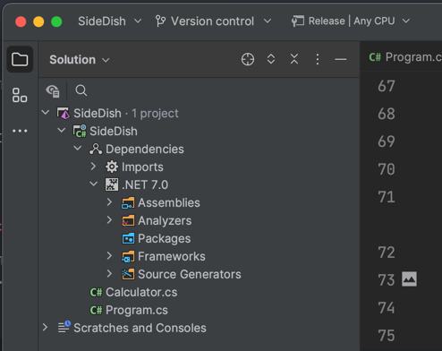

# Tests Side-By-Side

Some folks hate "extra" projects, I get it. The overhead and context shifting is a pain in the butt. What if you could have your tests in the same project? The approach is how the JavaScript community does testing with common frontend frameworks.

Well, with a few MSBuild elements and attributes you can.

This projects includes tests and test dependencies for the `Debug` build configuration, and excludes them when building for `Release`. You can see how that's done below.

```xml
<Project Sdk="Microsoft.NET.Sdk">

    <PropertyGroup>
        <OutputType>Exe</OutputType>
        <TargetFramework>net7.0</TargetFramework>
        <ImplicitUsings>enable</ImplicitUsings>
        <Nullable>enable</Nullable>
        <!-- 
        Keeps Microsoft.Net.Test.Sdk from generating an
        additional entry point, because this is a console app
        https://andrewlock.net/fixing-the-error-program-has-more-than-one-entry-point-defined-for-console-apps-containing-xunit-tests/
         -->
        <GenerateProgramFile>false</GenerateProgramFile>
    </PropertyGroup>
    
    <ItemGroup Condition="'$(Configuration)'=='RELEASE'">
        <Compile Remove="**/*.Tests.cs" />
    </ItemGroup>

    <ItemGroup Condition="'$(Configuration)'=='DEBUG'">
        <Compile Remove="XUnit_Shim.cs" />
        <PackageReference Include="Microsoft.NET.Test.Sdk" Version="17.5.0-preview-20221003-04" />
        <PackageReference Include="xunit" Version="2.4.2" />
    </ItemGroup>

</Project>
```

The approach to tests I've taken is to include tests in the same class to reduce Tokens in your `Debug` build.

```c#
// Calculator.cs
using System.Numerics;

namespace SideDish;

public partial class Calculator
{
    public T Add<T>(T left, T right)
        where T : INumber<T>
    {
        return left + right;
    }
}

// Calculator.Tests.cs
using Xunit;

namespace SideDish;

public partial class Calculator
{
    [Fact]
    public void Can_Add_2_and_2()
    {
        var calculator = new Calculator();
        Assert.Equal(4, calculator.Add(2, 2));
    }
}
```

I also use file nesting in [JetBrains Rider](https://jetbrains.com/rider) to reduce the noise in the solution explorer.



If you'd like to have test files in the same file and class, you'll need an XUnit shim that lets your app compile. I've included it below, but its not my cup of tea.

```c#
namespace Xunit;

public class FactAttribute : Attribute { }
public static class Assert { public static void Equal(object expected, object actual) {} }
```

Finally, if your project is a console application like in this sample, you'll need an additional `<GenerateProgramFile>false</GenerateProgramFile>` element in your `.csproj` to prevent the TestHost from generating an entry point. After all, you should already have one in `Program.cs`.

Cheers!